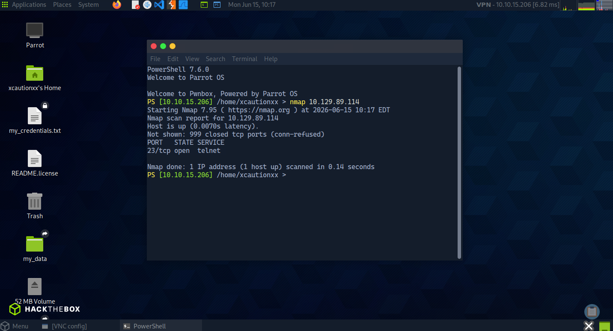
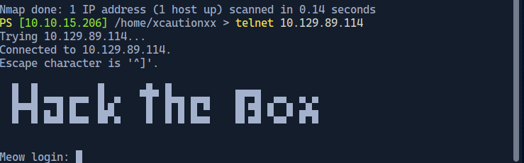
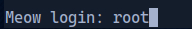
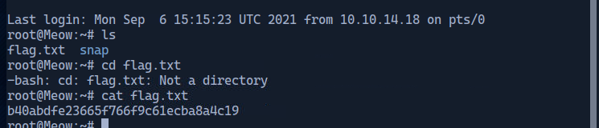

# Hack The Box — Meow

## Objetivo

Explorar a máquina `Meow` no Starting Point da Hack The Box e encontrar a flag no sistema.

## O que aprendi

Neste lab, aprendi o fluxo inicial de enumeração em uma máquina Linux:

- Verificar se o alvo está ativo
- Usar o `nmap` para identificar portas abertas
- Entender o serviço Telnet
- Acessar uma máquina remotamente
- Navegar no terminal Linux
- Ler arquivos com `cat`

## Reconhecimento

Primeiro, acessei a máquina do lab pela VPN da Hack The Box.

Depois executei o Nmap no IP fornecido:

```bash
nmap 10.129.89.114
```

O resultado mostrou que a porta `23/tcp` estava aberta:

```bash
23/tcp open telnet
```



## Enumeração

A porta 23 é usada pelo serviço Telnet.

Telnet é um protocolo antigo de acesso remoto. Ele permite conectar em uma máquina pela rede e tentar fazer login no terminal.

Como o serviço estava aberto, tentei acessar com:

```bash
telnet 10.129.89.114
```



## Exploração

Ao abrir a conexão Telnet, o sistema pediu um login.

Tentei o usuário:

```bash
root
```

O acesso foi permitido sem senha.

Isso indica uma configuração insegura: o usuário `root` estava acessível remotamente com senha em branco.



## Captura da flag

Depois de acessar a máquina, listei os arquivos do diretório atual:

```bash
ls
```

Foi encontrado o arquivo:

```bash
flag.txt
```

Então li o conteúdo com:

```bash
cat flag.txt
```



> Observação: antes de publicar no GitHub, é recomendado borrar ou cortar a flag real da imagem.

## Conclusão

O lab demonstrou uma falha básica, mas crítica: serviço Telnet exposto com acesso root sem senha.

Em um ambiente real, isso seria extremamente grave, pois permitiria acesso total ao sistema.

## Comandos usados

```bash
nmap 10.129.89.114
telnet 10.129.89.114
ls
cat flag.txt
```

## Conceitos praticados

- Nmap
- Enumeração de portas
- Telnet
- Login remoto
- Terminal Linux
- Leitura de arquivos
